<!-- ===== MIKU BACKGROUND ===== -->
<div align="center">

<!-- Background Image (Pixiv高收藏Miku图) -->


<!-- Overlay with gradient -->


</div>

<!-- ===== HEADER SECTION ===== -->
<div align="center">

<!-- Miku Logo -->


<!-- Miku GIF Gallery -->
<table>
  <tr>
    <td></td>
    <td></td>
    <td></td>
    <td></td>
  </tr>
  <tr>
    <td></td>
    <td></td>
    <td></td>
    <td></td>
  </tr>
</table>

<!-- Typing Animation with Miku Theme -->
[](https://git.io/typing-svg)

<!-- Profile Views -->


<!-- Miku Badges -->


</div>

<!-- ===== ANIMATED DIVIDER ===== -->
<div align="center">

</div>

<!-- ===== MIKU SECTION ===== -->
<div align="center">

## 🎤 初音未来 × 星工厂

<!-- Miku Image Gallery (Pixiv高收藏) -->
<table>
  <tr>
    <td></td>
    <td></td>
    <td></td>
    <td></td>
  </tr>
</table>

### `>_` Hey, I'm **fxrc** 

**Rebuilding the spirit of the internet** 🌟

<!-- Snake Animation -->


<!-- Miku Quote -->


</div>

<!-- ===== ANIMATED DIVIDER ===== -->
<div align="center">

</div>

<!-- ===== TECH STACK ===== -->
<div align="center">

## ⚡ Tech Stack

<!-- Miku themed tech badges -->


<!-- Tech Icons -->


<!-- Miku GIF -->


</div>

<!-- ===== ANIMATED DIVIDER ===== -->
<div align="center">

</div>

<!-- ===== SKILLS SECTION ===== -->
<div align="center">

## 🎯 Skills

<!-- Animated Skill Icons -->


<!-- Skill Progress Bars with Miku Colors -->
```
🎤 VOCALOID    ████████████████████████  95%
📸 Photography ████████████████████░░░░  85%
💻 Python      ████████████████████░░░░  85%
🌐 JavaScript  ████████████████░░░░░░░░  70%
⚛️  React       ████████████████░░░░░░░░  70%
🤖 AI/ML       ████████████████░░░░░░░░  70%
🎨 Design      ██████████████░░░░░░░░░░  60%
📦 Docker      ████████████░░░░░░░░░░░░  50%
```

<!-- Miku GIF -->


</div>

<!-- ===== ANIMATED DIVIDER ===== -->
<div align="center">

</div>

<!-- ===== GITHUB STATS ===== -->
<div align="center">

## 📊 GitHub Stats

<!-- Stats Card with Miku Theme -->


<!-- Streak Stats -->


<!-- Top Languages -->


<!-- Stats Card 2 -->


<!-- Miku GIFs -->
<table>
  <tr>
    <td></td>
    <td></td>
    <td></td>
  </tr>
</table>

</div>

<!-- ===== ANIMATED DIVIDER ===== -->
<div align="center">

</div>

<!-- ===== CONTRIBUTION GRAPH ===== -->
<div align="center">

## 🐍 Contribution Graph

<!-- Animated Snake -->


<!-- Contribution Stats -->


<!-- Miku GIF -->


</div>

<!-- ===== ANIMATED DIVIDER ===== -->
<div align="center">

</div>

<!-- ===== TROPHY SECTION ===== -->
<div align="center">

## 🏆 GitHub Trophies


<!-- Trophy Details -->


<!-- Miku GIFs -->
<table>
  <tr>
    <td></td>
    <td></td>
    <td></td>
    <td></td>
  </tr>
</table>

</div>

<!-- ===== ANIMATED DIVIDER ===== -->
<div align="center">

</div>

<!-- ===== ACTIVITY GRAPH ===== -->
<div align="center">

## 📈 Activity Graph


<!-- Activity Stats -->


<!-- Miku GIF -->


</div>

<!-- ===== ANIMATED DIVIDER ===== -->
<div align="center">

</div>

<!-- ===== MIKU GALLERY ===== -->
<div align="center">

## 🖼️ Miku Gallery

<!-- Pixiv高收藏Miku图片 -->
<table>
  <tr>
    <td></td>
    <td></td>
    <td></td>
  </tr>
  <tr>
    <td></td>
    <td></td>
    <td></td>
  </tr>
</table>

</div>

<!-- ===== ANIMATED DIVIDER ===== -->
<div align="center">

</div>

<!-- ===== MIKU MEME SECTION ===== -->
<div align="center">

## 🎲 Random Miku

<!-- Miku GIF Gallery -->
<table>
  <tr>
    <td></td>
    <td></td>
    <td></td>
  </tr>
  <tr>
    <td></td>
    <td></td>
    <td></td>
  </tr>
</table>

<!-- Random Meme -->


</div>

<!-- ===== ANIMATED DIVIDER ===== -->
<div align="center">

</div>

<!-- ===== CONTACT SECTION ===== -->
<div align="center">

## 📬 Contact

<!-- Animated Contact Cards -->
<a href="mailto:1569481169@qq.com">
  
</a>
<a href="mailto:h1569481169@gmail.com">
  
</a>


<!-- Social Links -->
<a href="https://github.com/fxrc415">
  
</a>

<!-- Miku GIF -->


</div>

<!-- ===== ANIMATED DIVIDER ===== -->
<div align="center">

</div>

<!-- ===== QUOTE SECTION ===== -->
<div align="center">

### 💬 Quote

> *"The internet was meant to be open and free. Let's rebuild that spirit."*
> 
> *— 星工厂 | Star Factory | 39*

<!-- Miku Quote -->
<table>
  <tr>
    <td></td>
    <td></td>
    <td></td>
  </tr>
</table>

<!-- Visitor Counter -->


<!-- Miku 39 Counter -->


<!-- Watermark -->
<sub>fxrc</sub>

</div>

<!-- ===== MIKU BACKGROUND FOOTER ===== -->
<div align="center">

<!-- Background Image (Pixiv高收藏Miku图) -->


</div>

<!-- ===== ANIMATED BACKGROUND ===== -->
<!--
  Miku Theme Colors:
  - Primary: #39C5BB (Miku Green)
  - Secondary: #FF6B9D (Pink)
  - Accent: #BA68C8 (Purple)
  - Background: #0a0a1a (Dark)
  
  Features:
  - 12+ Miku GIFs
  - 5+ Pixiv高收藏图片
  - Typing Animation
  - SVG Logo with animations
  - Snake Contribution Graph
  - Stats Cards (2 themes)
  - Trophy Cards (2 rows)
  - Activity Graph (2 styles)
  - Miku Gallery
  - Skill Progress Bars
  - Contact Cards
  - Animated Dividers
  - Background Images
-->

<!-- ===== SPONSOR SECTION ===== -->
<div align="center">

## ☕ Support

<a href="https://www.buymeacoffee.com/fxrc415">
  
</a>

<!-- Miku GIF -->


</div>
